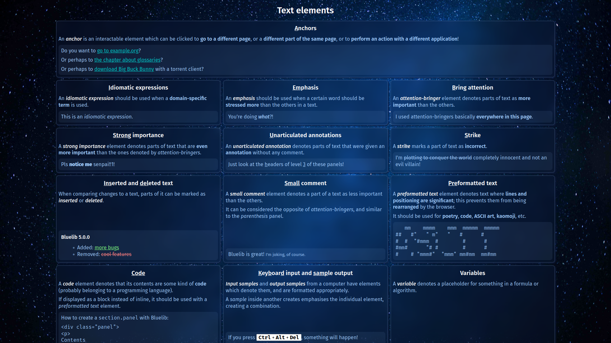

# Bluelib

A versatile and easy to use CSS stylesheet that supports fast dynamic recoloring via CSS variables

\[ [**Demo + Documentation**](https://gh.steffo.eu/bluelib/examples/index.html) | [**npm**](https://www.npmjs.com/package/@steffo/bluelib) \]

_Background image is [**Nebula Galaxy Photo** by Fabrice Nerfin on Unsplash](https://unsplash.com/photos/puHQJZd3MDg)._
