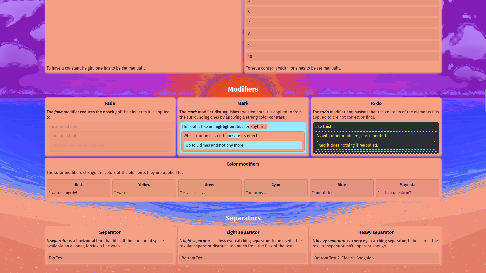

#  Bluelib

Customizable, flexible and modular CSS library.

## Links

 

 

## Screenshots

## Credits

### Royal Blue

- Background image: [**Nebula galaxy photo** by Fabrice Nerfin on Unsplash](https://unsplash.com/photos/puHQJZd3MDg)

### Gestione Amber

- Background image: [**Brown coffee beans on brown wooden table photo** by Anastasiia Chepinska on Unsplash](https://unsplash.com/photos/lcfH0p6emhw)

### Pixel Dawn

- Background image: **Pixel Dawn** by [Viktya](https://viktya.github.io) (original)

### Purple Star

- Background image: [**Calm body of water near alp mountains during nighttime photo** by kazuend on Unsplash](https://unsplash.com/photos/2KXEb_8G5vo)
